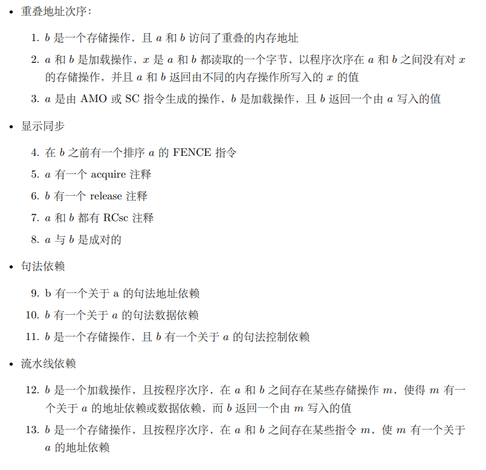
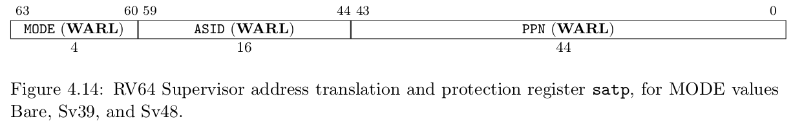
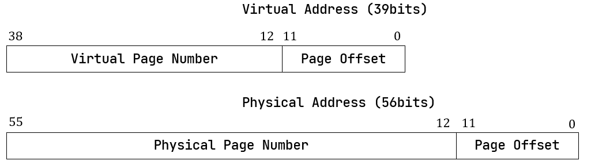
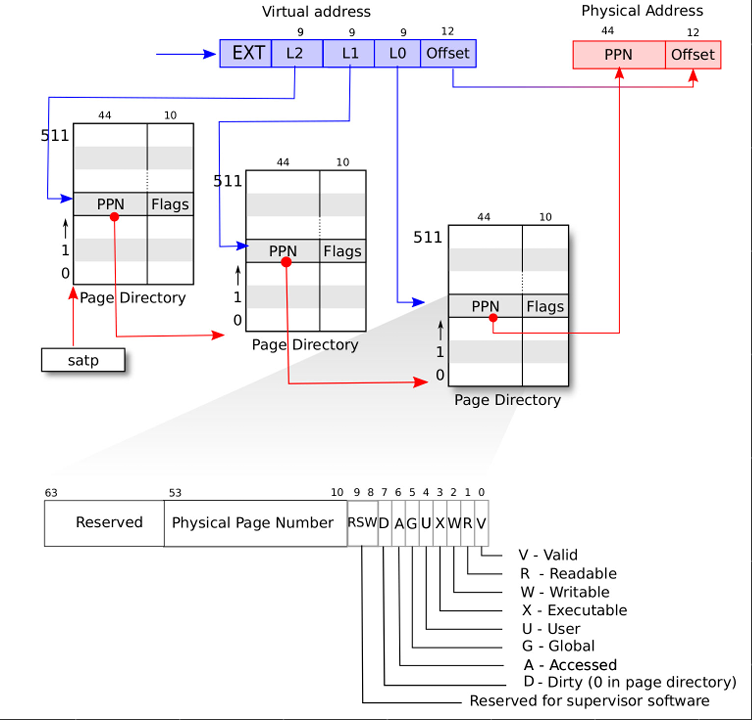
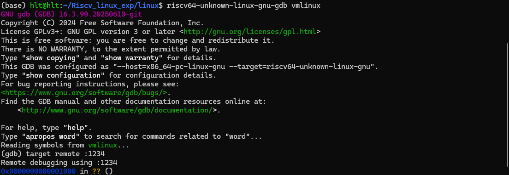
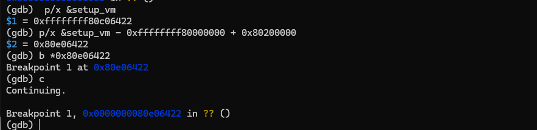
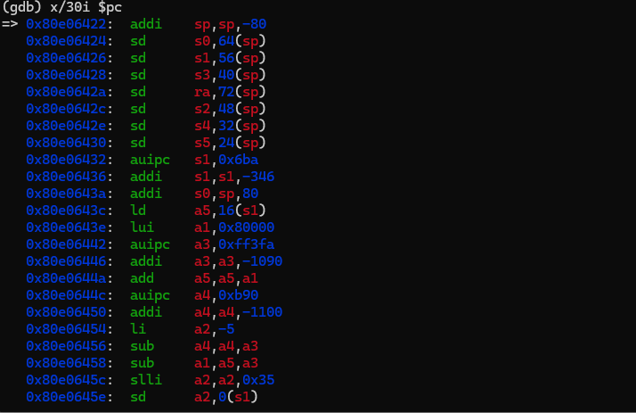
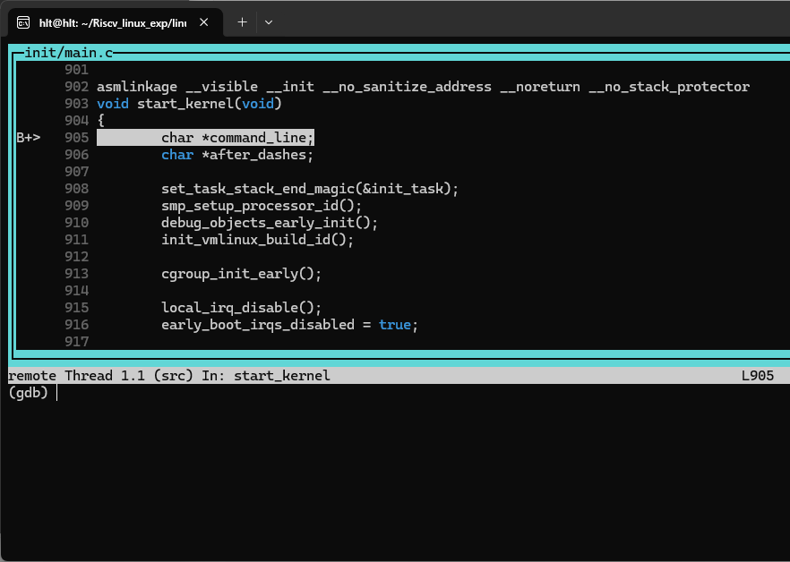

# Linux在RiscV架构上的迁移
## 目录：

<!-- @import "[TOC]" {cmd="toc" depthFrom=1 depthTo=6 orderedList=false} -->

<!-- code_chunk_output -->

- [Linux在RiscV架构上的迁移](#linux在riscv架构上的迁移)
  - [目录：](#目录)
  - [迁移部分](#迁移部分)
  - [Riscv部分基础指令集：](#riscv部分基础指令集)
    - [RiscV 基础整数编程模型](#riscv-基础整数编程模型)
    - [基础指令格式](#基础指令格式)
    - [基础的一些汇编指令](#基础的一些汇编指令)
    - [第一次读处理器架构见到的指令](#第一次读处理器架构见到的指令)
      - [内存排序指令(fence)：](#内存排序指令fence)
      - [指令获取屏障(fence.i)：](#指令获取屏障fencei)
      - [环境调用和断点](#环境调用和断点)
    - [原子操作:](#原子操作)
      - [AMO原子内存操作:](#amo原子内存操作)
      - [LR/SC:](#lrsc)
    - [控制与状态寄存器指令(CSR)](#控制与状态寄存器指令csr)
    - [CSR寄存器在Mmod和Smod](#csr寄存器在mmod和smod)
      - [M-mode CSR](#m-mode-csr)
      - [S-mode CSR](#s-mode-csr)
    - [RVWMO内存一致性模型](#rvwmo内存一致性模型)
      - [不允许重排序](#不允许重排序)
      - [允许重排序](#允许重排序)
      - [保留的程序次序](#保留的程序次序)
    - [C标准拓展（压缩）](#c标准拓展压缩)
  - [Linux Riscv的迁移](#linux-riscv的迁移)
    - [Linux启动流程：](#linux启动流程)
    - [OpenSBI简介](#opensbi简介)
      - [动机：](#动机)
      - [三种用法：](#三种用法)
      - [OpenSBI的链接脚本和启动汇编：](#opensbi的链接脚本和启动汇编)
    - [OpenSBI初始化：](#opensbi初始化)
    - [Linux初始化过程](#linux初始化过程)
    - [Linux 中断/异常处理流程](#linux-中断异常处理流程)
      - [异常处理入口](#异常处理入口)
      - [SBI 调用示例:](#sbi-调用示例)
      - [SV39分页机制](#sv39分页机制)
      - [SV39 页表初始化与内核重定位](#sv39-页表初始化与内核重定位)
    - [进程上下文切换的汇编实现 (`__switch_to`)](#进程上下文切换的汇编实现-__switch_to)
    - [异常处理与内核栈布局 (`pt_regs`)](#异常处理与内核栈布局-pt_regs)
  - [GDB调试和设备树分析](#gdb调试和设备树分析)
    - [调试启动](#调试启动)
    - [设备树分析](#设备树分析)
  - [Linux实验测试](#linux实验测试)
    - [1.实验目标：](#1实验目标)
    - [2.添加自定义系统调用](#2添加自定义系统调用)
      - [一：定义系统调用号](#一定义系统调用号)
      - [二：实现系统调用函数](#二实现系统调用函数)
      - [三：实现系统调用测试](#三实现系统调用测试)
    - [3.编写内核模块](#3编写内核模块)
    - [4.自动化 RootFS 构建](#4自动化-rootfs-构建)
    - [实验结果验证](#实验结果验证)
    - [5.遇到的问题与解决方案](#5遇到的问题与解决方案)
  - [总结](#总结)

<!-- /code_chunk_output -->


## 迁移部分
```
mkdir Riscv_linux_exp
cd Riscv_linux_exp
```
安装交叉编译链：
```
git clone https://github.com/riscv-collab/riscv-gnu-toolchain.git
cd riscv-gnu-toolchain
./configure --prefix=/opt/riscv64 --with-arch=rv64gc --with-abi=lp64d
sudo make linux
```
准备好相关代码仓库：
```
git clone https://github.com/qemu/qemu
git clone https://github.com/torvalds/linux
git clone https://git.busybox.net/busybox
```
编译QEMU：
```
cd qemu
./configure --target-list=riscv64-softmmu
make -j $(nproc)
sudo make install
```
编译opensbi：
```
git clone https://github.com/riscv/opensbi.git
cd opensbi/

make CROSS_COMPILE=riscv64-unknown-linux-gnu- \
     PLATFORM=generic \
     FW_TEXT_START=0x80000000 \
     -j$(nproc)    //如果这里不设置FW_TEXT_START会导致链接错误
```
编译linux内核：
```
cd linux
git checkout v6.12.0
make ARCH=riscv menuconfig    //在这里开启调试选项，具体来说：
    --->
  Kernel hacking  --->
    [*] Compile the kernel with debug info

```
检查一下：
```
# grep CONFIG_DEBUG_INFO .config
CONFIG_DEBUG_INFO=y

#随后进行编译
make ARCH=riscv CROSS_COMPILE=riscv64-unknown-linux-gnu- -j$(nproc)
```

构建rootfs文件系统：
```
dd if=/dev/zero of=rootfs.img bs=1M count=64
mkfs.ext4 rootfs.img

cd ~/Riscv_linux_exp/busybox
make ARCH=riscv CROSS_COMPILE=riscv64-unknown-linux-gnu- defconfig
make ARCH=riscv CROSS_COMPILE=riscv64-unknown-linux-gnu- -j$(nproc)

sudo mkdir -p /mnt/rootfs
sudo mount -o loop rootfs.img /mnt/rootfs
sudo cp ./busybox/busybox /mnt/rootfs/bin/busybox

sudo ln -sf busybox /mnt/rootfs/bin/sh
sudo ln -sf busybox /mnt/rootfs/bin/ls
sudo ln -sf busybox /mnt/rootfs/bin/cp
sudo ln -sf busybox /mnt/rootfs/bin/mount
sudo ln -sf busybox /mnt/rootfs/bin/umount
sudo ln -sf busybox /mnt/rootfs/bin/cat

sudo umount /mnt/rootfs
```

启动命令：
```
qemu-system-riscv64   -nographic   -machine virt   -cpu rv64   -m 256M   -bios opensbi/build/platform/generic/firmware/fw_jump.elf   -kernel linux/arch/riscv/boot/Image   -drive file=rootfs.img,if=virtio,format=raw   -append "root=/dev/vda rw console=ttyS0 earlycon=sbi"
```
开启调试：
```
qemu-system-riscv64   -nographic   -machine virt   -cpu rv64   -m 256M   -bios opensbi/build/platform/generic/firmware/fw_jump.elf   -kernel linux/arch/riscv/boot/Image   -drive file=rootfs.img,if=virtio,format=raw   -append "root=/dev/vda rw console=ttyS0 earlycon=sbi"   -S -s
```
在另一个终端开启监听：
```
riscv64-unknown-linux-gnu-gdb vmlinux  //对内核启动过程进行调试
riscv64-unknown-linux-gnu-gdb   opensbi/build/platform/generic/firmware/fw_jump.elf  //对opensbi进行调试
(gdb) target remote :1234
```
## Riscv部分基础指令集：
### RiscV 基础整数编程模型
RiscV类似于Linux的原因之一便是其拓展指令集的模块化，在拓展指令集之上可以分为整数指令集（I）、乘除法扩展（M）、原子操作扩展（A）、单精度浮点扩展（F）、双精度浮点扩展（D）等。

在基础整数ISA上并没有专门的栈指针或子程序返回地址链接的寄存器；指令编码允许任何的x寄存器用于这些目的。但是，RiscV约定了某些寄存器用于特定的用途，以便于软件的编写和理解。

RiscV的32个寄存器的功能：
| 寄存器 | 别名  | 功能描述               |
|--------|-------|------------------------|
| x0     | zero  | 恒为0                  |
| x1     | ra    | 返回地址寄存器         |
| x2     | sp    | 堆栈指针寄存器         |
| x3     | gp    | 全局指针寄存器         |
| x4     | tp    | 线程指针寄存器         |
| x5-x7     | t0-t2    | 临时寄存器0-2    |
| x8     | s0/fp | 保存寄存器0/帧指针   |
| x9     | s1    | 保存寄存器1            |
| x10-x11    | a0-a1    | 函数参数/返回值寄存器   |
| x12-x17    | a2-a7    | 函数参数寄存器         |
| x18-x27    | s2-s11   | 保存寄存器2-11      |
| x28-x31    | t3-t6    | 临时寄存器3-6      |


### 基础指令格式
RiscV指令集采用固定的32位指令长度，指令格式主要分为以下几种类型：
1. R型指令（寄存器-寄存器操作）
2. I型指令（立即数操作）
3. S型指令（存储操作）
4. B型指令（分支操作）
5. U型指令（上位立即数操作）
6. J型指令（跳转操作）

### 基础的一些汇编指令


### 第一次读处理器架构见到的指令
#### 内存排序指令(fence)：
fence我们翻译为栅栏，用于控制内存操作的顺序，确保在fence指令之前的所有内存操作(load/store)在fence指令之后的所有内存操作之前完成。这一点和栅栏的功能类似。确保了多核（或多线程）环境下内存操作的可见性和一致性。

**为什么需要fence？**

这涉及RISC-V的存储模型。RISC-V采用的是 RISC-V Weak Memory Ordering (RVWMO)模型，对存储操作的执行顺序限制较少，为了保证一致性需要特殊的指令来规范存储操作的执行顺序。


fence指令的语法如下：
```asm
fence [pred], [succ]
```
pred, succ由四个字段组成：
- I: 输入（Input）
- O: 输出（Output）
- R: 读（Read）
- W: 写（Write）

实际上，在标准 RISC-V 中，I 和 O 通常被忽略或视为保留，主流实现主要关注 R 和 W。：
```asm
fence rw, rw  # 最严格的屏障：所有 load/store 之前的操作必须完成，之后的操作不能提前
fence r, w     # load 之后的 store 不能重排到 load 之前（常用于 acquire 语义）
fence w, r     # store 之后的 load 不能重排到 store 之前（常用于 release 语义）
```

#### 指令获取屏障(fence.i)：
fence是对内存的数据访问行为进行排序，而fence.i是对取指行为进行排序。确保 写入内存的指令对后续取指可见。

假设CPU中并无分离的icache和dcache，那么当我们某时刻使用store指令修改内存中的某个指令之后，下一次 CPU 取指时会直接从内存读取最新内容。
但为了防止流水线中已经预取了旧指令，只需 清空（flush）流水线，让后续取指从更新后的内存地址重新开始。

但是对于有独立指令缓存（icache）和数据缓存（dcache）的CPU来说，情况就不同了。因为store指令修改的是数据缓存，而取指是从指令缓存中获取指令的，这两个缓存是独立的，修改数据缓存并不会自动更新指令缓存。

因此，在这种情况下，必须使用fence.i指令来确保指令缓存中的内容与内存中的内容一致。fence.i指令会强制刷新指令缓存，使得后续的取指操作能够获取到最新的指令内容。
#### 环境调用和断点

SYSTEM指令用于访问可能需要访问特权的系统功能，使用I指令进行编码。这些指令可被分为两部分：原子性的“读-修改-写”控制和状态寄存器(CSR)相关的指令，所有其他潜在特权指令；基础的非特权指令：

```asm
ecall  # 环境调用指令，用于从用户模式切换到特权模式，通常用于系统调用
ebreak # 断点指令，用于调试目的
```
### 原子操作:
#### AMO原子内存操作:
原子内存操作为多处理器同步执行读-写-修改操作，确保对共享内存的操作不会被其他处理器或线程打断，从而避免数据竞争（data race）问题

为什么需要AMO?
```asm
// 假设 x = 0
Core1: load x → 0; add 1 → 1; store x → x=1
Core2: load x → 0; add 1 → 1; store x → x=1  // 期望结果是2，实际是1！
```
AMO 指令将“读-改-写”整个过程变成**不可分割**的原子操作

支持的操作有：交换、整数加法、按位 AND、按位 OR、按位 XOR、有符号/无符号整数的
取最大值/取最小值
```asm
amoadd.w rd, rs2, (rs1)  # 将内存地址(rs1)处的值加上rs2的值，结果存回内存，并将原值加载到rd
amoxor.w rd, rs2, (rs1)  # 将内存地址(rs1)处的值与rs2的值进行按位异或，结果存回内存，并将原值加载到rd
amoand.w rd, rs2, (rs1)  # 将内存地址(rs1)处的值与rs2的值进行按位与，结果存回内存，并将原值加载到rd
amoor.w rd, rs2, (rs1)   # 将内存地址(rs1)处的值与rs2的值进行按位或，结果存回内存，并将原值加载到rd
amoswap.w rd, rs2, (rs1)  # 将rs2的值存回内存地址(rs1)，并将原值加载到rd
amomin[u].w rd, rs2, (rs1)   # 将内存地址(rs1)处的值与rs2的值进行比较，取较小值存回内存，并将原值加载到rd
amomax[u].w rd, rs2, (rs1)   # 将内存地址(rs1)处的值与rs2的值进行比较，取较大值存回内存，并将原值加载到rd

```

#### LR/SC:
虽然 AMO 指令可以高效完成“读-改-写”类的固定原子操作（如加法、交换等），但无法实现条件性原子操作（如仅当内存值等于某个预期值时才进行更新）。为了解决这个问题，RISC-V 引入了 Load-Reserved (LR) 和 Store-Conditional (SC) 指令对。

**LR:从内存地址加载一个值到寄存器,同时，对该地址设置一个“保留标记”（reservation），表示当前 hart（硬件线程）正在“监视”这块内存**
```asm
lr.w rd, (rs1)  # 从内存地址(rs1)加载一个字到寄存器rd，并设置保留标记
```
**SC:尝试将寄存器的值存回内存地址，但只有在该地址的保留标记仍然有效时才成功**
```asm
sc.w rd, rs2, (rs1)  # 尝试将寄存器rs2的值存回内存地址(rs1)
                        if rd == 0 success!
                        elif rd == 1 fail!
```
1. LR 和 SC 必须作用于同一个对齐的内存地址
2. 在 LR 和 SC 之间不能有太多指令（某些实现有“保留窗口”限制）
3. 如果其他 hart 修改了该地址，或发生了中断、异常等，**保留标记**会被清除，导致 SC 失败。
4. 不可嵌套，一次只能有一个有效的LR/SC对，再次执行LR会覆盖之前的保留标记。

例如实现spinlock：
```asm
lock:
    li t0, 1
try_lock:
    lr.w t1, (a0)        #a0 是一个符号调用的地址，在此之前的代码可能类似于:
                load a0, lock_variable_address  (volatile int mylock=0, lock(&mylock))
                jal lock                        


    bnez t1, try_lock 
    sc.w t2, t0, (a0)
    bnez t2, try_lock
    ret
unlock:
    li t0, 0
    fence w, w 
    sw t0, (a0)
    ret
```

### 控制与状态寄存器指令(CSR)
RISC-V架构定义了一组控制与状态寄存器(CSR)，用于管理处理器的各种功能和状态。CSR指令允许软件读取和修改这些寄存器，以实现特权操作、异常处理、中断管理等功能。
CSR指令主要包括以下几种类型：
1. 原子性读/写CSR
2. 原子性读/置位CSR
3. 原子性读/清除CSR 

CSR指令的语法如下：
```asm
csrrw rd, csr, rs1  # 读取CSR寄存器的值到rd，并将rs1的值写入CSR寄存器
csrrs rd, csr, rs1  # 读取CSR寄存器的值到rd，rs1中的初始值被视为位掩码，从CSR寄存器中设置相应的位
csrrc rd, csr, rs1  # 读取CSR寄存器的值到rd，rs1中的初始值被视为位掩码，从CSR寄存器中清除相应的位

对于csrrw，如果rd=x0，则表示仅写CSR寄存器而不读取其值。
对于csrrs和csrrc，如果rs1=x0，则表示仅读取CSR寄存器的值而不修改其内容。

读csr的汇编伪指令：
csrr rd, csr  ==   csrrs rd, csr, x0
写csr的汇编伪指令：
csrw csr, rs1  ==   csrrw x0, csr, rs1
```

### CSR寄存器在Mmod和Smod
#### M-mode CSR
`mstatus`:
状态寄存器，保存了全局中断使能状态和其他状态，例如在切换模式之前保存当前的模式。

`mtvec`:
异常入口基地址寄存器。保存发生异常时需要跳转的地址。

`medeleg`和`mideleg`:
​ `medeleg`是异常委托，`mideleg`是中断委托。例如，在M模式下发生异常或中断时，可以通过这两个寄存器，将中断/异常交给S模式或者其他模式处理。

`mip`和`mie`:
`mie`是中断使能寄存器，对需要使能的中断，在对应位使能。
`mip`是中断等待寄存器，表示目前正准备处理的中断。

`hpm`:
全称Hardware Performance Monitor，硬件性能单元，用于性能计数。包括了两类寄存器：`mhpmcounter`和`mhpmevent`

​ `mhpmcounter`：性能计数器

​ `mhpmevent`：用于配置性能事件

`mcounteren`和`mcountinhibit`:
这两个也是是hpm相关的寄存器，主要用于控制hpm的使能、计数禁止。

​ `mcounteren`：计数器使能
​ `mcountinhibit`：禁止计数

`mscratch`:
用于保存M模式指向hart上下文的指针,并在进入M模式的处理程序时，和用户寄存器交换。

`mepc`:
发生中断时，当前程序的PC值，保存在mepc中，中断返回时，会从mepc读取PC值。

`mcause`:
​ 用于保存发生中断或异常的情况。

`mtval`:
异常值寄存器，例如发生异常时，保存出错的地址。

#### S-mode CSR
S模式的CSR和M模式基本上是一样的，只不过将第一个字母m改为了s，例如mcause改为了scause，mvtal改为了svtal。它们的功能基本相同，这里就不再赘述了。

需要注意的是，S模式除了拥有M模式相同功能的CSR外，另外还增加了一个stap寄存器。

satp寄存器主要是给MMU使用，satp寄存器保存了页表的基地址，MMU通过satp可以找到第一级页表，进而找到物理地址。

### RVWMO内存一致性模型
RVWMO即RISC-V Weak Memory Ordering，是RISC-V架构定义的一种内存一致性模型。它允许处理器在执行内存操作时进行一定程度的重排序，以提高性能和并行性。

用于规定多核（或多线程）环境下，不同 hart（硬件线程）对共享内存的读写操作在何时、以何种顺序对其他 hart 可见。

也就是说，运行在一个硬件线程的代码a看似是在有序地执行，但是从另一个硬件线程的内存指令来看，可能a内存指令正在以一种不同的次序被执行。RVWMO允许这种行为，以便处理器可以更高效地利用其资源。具体而言：
#### 不允许重排序
```
load -> load 同一个hart中， 两个load必须按照顺序执行
load -> store 同一个hart中， load必须在store之前完成
store -> store 同一个hart中， 两个store必须按照顺序执行
```
#### 允许重排序
```
store -> load 同一个hart中， store可以在load之前完成
```

我们观察允许重排序的部分，试想一下，如果两个hart之间相互影响，即第二个hart的load依赖于第一个hart的store，那么就会出现问题：
```asm
; Hart 0                  ; Hart 1
sw x1, flag0             lw x2, flag1
lw x3, flag1             sw x4, flag0

顺序执行的情况下，不可能出现 x3 == 0 && x2 == 0 的情况

但是在允许重排序的情况下，就可能出现这种情况：
Hart 0 可能先执行 lw x3, flag1（看到 0），再执行 sw x1, flag0;
Hart 1 可能先执行 lw x2, flag0（看到 0），再执行 sw x4, flag1;
``` 

因此多线程代码也需要显式同步，来保证不同hart之间的内存操作顺序。

因此需要之前提到的fence来限制重排序

#### 保留的程序次序



### C标准拓展（压缩）
RVC 使用了一个简单的压缩策略，它提供常见 32 位 RISC-V 指令的较短的 16 位版本，当：
1. 立即数或地址偏移量较小，或者
2. 其中一个寄存器是零寄存器（x0）、ABI 链接寄存器（x1），或者 ABI 栈指针（x2），或者
3. 目的寄存器和第一个源寄存器完全相同，或者
4. 使用的寄存器是 8 个最流行的寄存器。

C拓展允许16位的指令和32位的指令混合，其中32位指令可以从任何16位的边界开始。

## Linux Riscv的迁移

### Linux启动流程：

启动参数：
使用了qemu模拟器，同时使用busybox提供小型的rootfs文件系统，以及支持一个很小的shell环境。
```bash
qemu-system-riscv64   -nographic   -machine virt   -cpu rv64   -m 256M   -bios opensbi/build/platform/generic/firmware/fw_jump.elf   -kernel linux/arch/riscv/boot/Image   -drive file=rootfs.img,if=virtio,format=raw   -append "root=/dev/vda rw console=ttyS0 earlycon=sbi"   -S -s//启动调试
```


1. 系统上电或复位后，从 只读存储器（ROM，如 Mask ROM 或 Boot ROM）开始执行，加载 SPL（Secondary Program Loader）到 片上 SRAM（On-Chip SRAM）。
2. SPL 运行阶段：
- 初始化 DDR 内存控制器；
- 将 OpenSBI（作为 M-mode 运行时固件）和 Bootloader（如 U-Boot）从存储介质（如 SPI-NOR、eMMC）加载到 DDR 中。
3. OpenSBI 运行阶段：
- 完成基础硬件初始化（如串口、中断控制器）；
- 配置系统安全机制（如 PMP、PLIC）；
- 提供标准 SBI 接口，为后续 Bootloader 或 OS 提供运行时服务。
4. Bootloader（如 U-Boot）：
- 初始化外设子系统（如存储、网络、文件系统）；
- 从存储设备（如 eMMC、SD、NVMe、TFTP）加载 Linux 内核、设备树（DTB）和 initramfs；
- 设置启动参数，并将控制权移交至 Linux 内核。到DDR
- 最后运行在RISCV core上的只有opensbi和Linux，而Linux可以通过sbi接口来调用opensbi

首先理解一下这其中的术语和原因：
```txt
SPL:二级程序加载器，虽然叫 “二级”，但在很多系统中它实际上是 第一级可编程的 bootloader。

片上 SRAM（On-Chip SRAM）：集成在 SoC 芯片内部的小容量静态 RAM（通常 64KB ~ 512KB）

DDR：双倍数据速率同步动态随机存取存储器，传统的 SDRAM（Single Data Rate）在每个时钟周期的上升沿传输一次数据。DDR 内存在每个时钟周期的上升沿和下降沿都传输数据，数据传输速率是时钟频率的两倍。

注意：DDR 不像 SRAM 那样上电就能用，它需要复杂的初始化序列。
同时SRAM的太小，无法存放完整的bootloader和OS，所以需要先用SPL初始化DDR，然后再加载更大的程序到DDR中运行。
```

```txt
本实验中，情况略有不同，由于是直接使用QEMU模拟器启动，则跳过了ROM和SPL阶段，直接从OpenSBI开始执行(-bios fw_jump.elf)。

同时，由于不需要高级的初始化功能，OpenSBI后续直接启动Linux内核(-kernel linux)，而没有经过Bootloader阶段。
```

### OpenSBI简介
OpenSBI（Open Source Supervisor Binary Interface）是一个开源的RISC-V特权软件实现，提供了RISC-V处理器与操作系统之间的接口。它实现了RISC-V的Supervisor Binary Interface（SBI），允许操作系统在特权模式下运行，并提供了一些基本的系统服务，如中断处理、定时器管理和内存管理等。


#### 动机：
OpenSBI的设计主要是为了提供一个标准化的接口，不同的厂商可能有不同的M-mode代码， 如果每个操作系统都要适配不同厂商的M-mode代码，那么工作量会非常大。OpenSBI作为一个中间层，提供了一个统一的接口，操作系统只需要适配OpenSBI，而不需要关心底层的M-mode实现。

#### 三种用法：
|模式|描述|对应二进制文件|
|----|----|--------------|
|fw_jump|仅提供SBI服务，跳转到外部payload(Uboot或Linux)|fw_jump.elf|
|fw_payload|包含SBI服务和payload（Uboot或Linux）|fw_payload.elf|
|fw_dynamic|SBI服务和payload分开加载|fw_dynamic.elf|

因此需要重定位支持(rela_dyn_start)，PMP对齐。

#### OpenSBI的链接脚本和启动汇编：
从链接脚本里可以清晰地看到固件的地址规划和排布

**fw_jump.elf.ldS**:
```ld
OUTPUT_ARCH(riscv)
ENTRY(_start)

SECTIONS
{
	#include "fw_base.ldS"

	PROVIDE(_fw_reloc_end = .);
}
```

**fw_base.ldS**:

代码量较长，首先设置固件起始地址：
```ld
. = FW_TEXT_START;
	/* Don't add any section between FW_TEXT_START and _fw_start */
	PROVIDE(_fw_start = .);
```
接下来每一段都是以section的形式进行划分，对齐到4KB的页大小，便于内存管理。
分为以下几部分：
```ld
    .text : { *(.text*) }           // 代码段
    .rodata : { *(.rodata*) }       // 只读数据段
    .dynsym : { *(.dynsym*) }       // 动态符号表
    .rela.dyn : { *(.rela.dyn*) }   // 动态重定位表

***在此之前是只读部分***
    /*
	 * PMP regions must be to be power-of-2. RX/RW will have separate
	 * regions, so ensure that the split is power-of-2.
	 */
	. = ALIGN(1 << LOG2CEIL((SIZEOF(.rodata) + SIZEOF(.text)
				+ SIZEOF(.dynsym) + SIZEOF(.rela.dyn))));
***在此之后是rw部分***
而上述代码的部分就是假设只读部分大小不是2的幂次方，那么通过ALIGN对齐到下一个2的幂次方地址，方便PMP（Physical Memory Protection，物理内存保护）进行权限划分。

    .data : { *(.data*) }           // 数据段
    .bss : { *(.bss*) }             // 未初始
```
### OpenSBI初始化：

REF:https://github.com/riscv-software-src/opensbi/blob/master/docs/firmware/fw.md

1. hartid via a0 register
2. device tree blob address in memory via a1 register. The address must be aligned to 8 bytes

根据连接脚本fw_jump.elf.ldS，程序入口点为_start，从start开始：

1. _start:选择用来boot的hart
```S
_start:
    /* 保存关键寄存器(a0-a2)到临时寄存器(s0-s2) */
    MOV_3R  s0, a0, s1, a1, s2, a2  // s0=a0, s1=a1, s2=a2
    /* 获取引导HART ID */
    call    fw_boot_hart            // 调用函数获取引导HART ID
    add     a6, a0, zero            // a6 = 返回值 (引导HART ID)
    /* 恢复原始寄存器值 */
    MOV_3R  a0, s0, a1, s1, a2, s2  // a0=s0, a1=s1, a2=s2
    /* 检查是否指定了引导HART */
    li      a7, -1                  // a7 = -1 (无效HART标志)
    beq     a6, a7, _try_lottery    // 如果引导HART=-1，跳转到彩票机制
    /* 当前HART不是引导HART则等待 */
    bne     a0, a6, _wait_for_boot_hart  // 如果a0(当前HART)≠a6(引导HART)，跳转等待

_try_lottery:
    /* 使用原子操作竞争引导权限 */
    lla     a6, _boot_lottery       // a6 = 彩票变量地址（通常为0）
    li      a7, BOOT_LOTTERY_ACQUIRED  // a7 = 彩票获取值(通常=1)
#ifdef __riscv_atomic
	amoswap.w a6, a7, (a6)
	bnez	a6, _wait_for_boot_hart
#elif __riscv_zalrsc
_sc_fail:
	lr.w	t0, (a6)
	sc.w	t1, a7, (a6)
	bnez	t1, _sc_fail
	bnez	t0, _wait_for_boot_hart
#else
#error "need a or zalrsc"
#endif

```
2. _relocate: 由于程序链接的地址可能与bootloader实际加载的地址不一样，因此需要重定位。
3. _relocate_done: 重定位完成后，进行基本的初始化工作，/* Reset all registers except ra, a0, a1, a2, a3 and a4 for boot HART */，设置堆栈指针、清除BSS段等。
4. 调用fw_platform_init进行平台相关的初始化工作，比如设置时钟、中断控制器等。
5. 先为多个hart预留一定的堆空间，由于堆是从底向上增长的，因此每个hart的堆空间是从高地址向低地址分配的。每个hart负责初始化scratch
```txt
为什么需要scratch？
RISC-V SBI 标准明确规定每个 HART 必须有一个 struct sbi_scratch， 参考sbi_scratch.h
由于RISCV系统支持多核，每个Hart独立运行，SBI需要在不依赖调度器的情况下为每个HART保存相关参数。
```
6. FDT重定位：核心功能是根据编译时的配置参数，计算并返回FDT的地址，供下一阶段（如 U-Boot 或 Linux 内核）使用

7. sbi_init:
初始化当前HART的sbi库，接收struct sbi_scratch参数(之前存放在堆里面，每个hart独立，现在加载CSR_MSCRATCH)，设置栈指针和中断处理。
```txt
在sbi_init中lib/sbi/sbi_init.c
启动模式判断：根据next_mode字段（M/S/U模式）验证当前HART是否支持目标特权模式。
冷启动（Coldboot）与热启动（Warmboot）选择：
随机选择一个满足条件的HART执行完全初始化（Coldboot）。
其余HART执行部分初始化（Warmboot），跳过重复配置
平台相关初始化：调用平台回调函数（如sbi_platform_early_init），完成硬件特定配置（时钟、中断、串口等）。
关键组件初始化：
中断代理（SSIP/STIP/SEIP、异常代理）。
控制台（sbi_console_init）。
PMU、TLB、定时器（sbi_pmu_init/sbi_tlb_init/sbi_timer_init）等。
跳转至下一阶段：根据next_addr和next_mode，将控制权移交下一引导阶段（如U-Boot/Linux）。
```
SBI提供的中断异常服务将在linux中的具体调用中提到。

### Linux初始化过程
首先查看链接脚本/riscv/kernel/vmlinux.Ids.S，其中提到了首先执行的部分为ENTRY(_start)。
我们从_start开始分析(_start位于head.S)：
```S
SYM_CODE_START(_start)
    /*
     * Image header expected by Linux boot-loaders. The image header data
     * structure is described in asm/image.h.
     * Do not modify it without modifying the structure and all bootloaders
     * that expects this header format!!
     */
    j _start_kernel
    .word 0
    .balign 8
    /* ... image header fields ... */
SYM_CODE_END(_start)
```
这段嵌入了一个标准化的Image Header，供 bootloader 识别镜像格式、加载偏移、魔数等关键元信息。
紧接着跳转到_start_kernel(这里是内核真正初始化的地方):
```S
_start_kernel:
SYM_CODE_START(_start_kernel)
	/* Mask all interrupts */
	csrw CSR_IE, zero
	csrw CSR_IP, zero  //首先设置中断屏蔽，防止在初始化过程中被打断
#ifdef CONFIG_RISCV_M_MODE
    fence.i
    call reset_regs
    la a0, .Lpmp_done   
	csrw CSR_TVEC, a0   //如果内核直接运行在M模式下(无内核)尝试设置PMP, 如果不支持PMP，那么这段代码可以保证能够直接跳转到PMP结束，避免异常。

	li a0, -1
	csrw CSR_PMPADDR0, a0
	li a0, (PMP_A_NAPOT | PMP_R | PMP_W | PMP_X)
	csrw CSR_PMPCFG0, a0
```
下一步加载全局指针global_pointer

随后多核协调启动(CONFIG_RISCV_BOOT_SPINWAIT)：在这里面，首先通过lottery机制选择一个引导核(hart)，其他核则进入等待状态，直到引导核完成初始化并发出启动信号
```txt
剩余的将由主CPU通过SBI_IPI启动，执行secondary_start_sbi, 初始化自己的栈，页表，trap，调用smp_callin加入调度系统。
```

下一步清理BSS段，初始化栈，建立临时页表(CONFIG_MMU):1:1映射

设置异常向量:
```S
    la a0, handle_exception
    csrw CSR_TVEC, a0
```
跳转到C语言主干：
```S
tail start_kernel     // 永久跳转到 init/main.c:start_kernel()
```
在C语言主干(/init/main.c)中，

**1.最早期准备**

在进入 start_kernel 初期，仍有一小段代码在显式禁用中断之前运行，用于建立最基本的执行环境，例如栈边界标记、CPU ID、早期调试设施与 cgroup 的早期初始化。

```c
set_task_stack_end_magic(&init_task);  // 标记 init（0号）进程栈边界，用于检测栈溢出
smp_setup_processor_id();              // 设置/获取当前引导 CPU 的逻辑 ID
debug_objects_early_init();            // 初始化调试对象跟踪（early）
cgroup_init_early();                   // cgroup 的早期初始化
```

**2.锁定环境与架构初始化（中断已禁用）**

内核通常在此处显式禁用本地中断以防并发干扰，随后进行架构相关的早期初始化（如解析设备树、设定物理内存布局等）。

```c
local_irq_disable();           // 关中断，进入原子初始化阶段
early_boot_irqs_disabled = true;
boot_cpu_init();               // 标记并初始化引导 CPU
pr_notice("%s", linux_banner); // 打印内核 banner（版本信息）
setup_arch(&command_line);     // 架构相关的早期初始化（DTB/内存/命令行等）
```
```txt
setup_arch() 的职责范围很广：解析 DTB/ACPI、发现内存边界、设置早期页表（如需要）以及处理早期命令行参数（例如 earlycon、mem= 等）
```
**3.核心子系统按顺序初始化（中断仍禁用）**

在中断仍然被禁止的情况下，内核按严格顺序初始化基础子系统，顺序十分重要，因为后续子系统依赖先前建立的环境。

按顺序完成：
|顺序| 关键函数 | 作用 |
|----|----------|------|
|1 | mm_core_init() | 内存管理核心（页分配器等）初始化|
|2 | sched_init() | 调度器初始化，建立runqueue，创立idle线程|
|3 | workqueue_init_early() | 工作队列子系统初始化，允许创建早期工作项|
|4 | rcu_init() | RCU(无锁同步机制)初始化|
|5 | early_irq_init() -> init_IRQ() | 中断子系统初始化，设置中断控制器与向量表|
|6 | timekeeping_init() -> time_init() | 时间子系统：clocksource，jiffies，高精度定时器等| 

注：此阶段虽然中断控制器被配置，但本地 CPU 中断仍通常处于禁用状态，时钟中断不会立即触发。


**4.启用中断与控制台输出**

```c
local_irq_enable(); // 允许本地中断，时钟中断与调度事件开始生效
console_init();     // 初始化 console，prink/log 输出可见
```

**5.后期初始化（中断已启用，可进行阻塞操作）**

打开中断和控制台后，内核进入允许更复杂操作的后期初始化阶段（可以进行可能阻塞的内存分配、子系统完整初始化等）。部分重要步骤（按代码大致顺序）：

这个阶段初始化的子系统（部分列举，按代码大致顺序）：

  * **锁依赖检测调试**：`lockdep_init()`, `locking_selftest()` (需要在开中断环境下测试)。
  * **后期内存管理**：`setup_per_cpu_pageset()`, `kmem_cache_init_late()` (Slab/Slub 后期初始化)。
  * **性能分析工具**：`perf_event_init()`, `profile_init()`。
  * **ACPI/电源管理早期初始化**：`acpi_early_init()`。
  * **时钟校准**：`calibrate_delay()` (计算 BogoMIPS)。
  * **架构最终初始化**：`arch_cpu_finalize_init()`。

接下来是一系列重要组件的初始化：

| 关键函数 | 作用描述 |
| :--- | :--- |
| `cred_init()`, `fork_init()` | 初始化进程凭证管理，设置进程创建所需的数据结构（如 max\_threads）。 |
| `security_init()` | **安全框架初始化**。初始化 LSM (Linux Security Modules)，如 SELinux 或 AppArmor。 |
| `net_ns_init()` | **网络命名空间初始化**。为网络协议栈的初始化做准备。 |
| `vfs_caches_init()` | **VFS 缓存初始化**（相比 vfs\_caches\_init\_early 更完整）。建立 dentry 和 inode 缓存，这是文件系统工作的基础。 |
| `proc_root_init()` | 初始化 `/proc` 文件系统。 |
| `cgroup_init()` | cgroup 完整初始化。 |


**6.启动Init进程（PID 1）**

```c
rest_init(); // 不返回：启动 kernel_init（PID1）与 kthreadd，当前变为 idle
```

`rest_init` 不会返回，它的主要工作是：

1.  创建一个新的内核线程 `kernel_init`（这将演变为 PID 1 的 init 进程）。
2.  创建另一个内核线程 `kthreadd`（负责管理所有其他内核线程，PID 2）。
3.  当前执行 `start_kernel` 的 0 号线程此时化身为 idle 线程（空闲线程），进入无限循环，在没有其他任务运行时被调度执行，通常用于执行低功耗指令。

**后续流程 (在 kernel\_init 线程中):**

  * 调用 `do_initcalls()`：按优先级顺序执行所有编译进内核的驱动程序和模块的 `__init` 函数。
  * 挂载根文件系统 (Rootfs)。
  * 寻找并执行用户空间的 init 程序（如 `/sbin/init`, `/lib/systemd/systemd`, `/bin/sh` 等）。
  * 至此，内核启动完成，系统控制权移交给用户空间。

### Linux 中断/异常处理流程

#### 异常处理入口
在 `head.S` 中设置的 `handle_exception` 是所有 trap 的统一入口：

```S
handle_exception:
    // 保存上下文到栈
    csrr t0, CSR_CAUSE       // 读取异常原因
    blt t0, zero, handle_interrupt  // CAUSE 最高位为1表示中断
    // 否则是同步异常(系统调用/缺页等)
    call do_trap_<type>      // 根据 CAUSE 值调用具体处理函数
```
```
用户态 ecall → trap 到 S-mode → handle_exception 
→ do_trap_ecall_u() → syscall() → sys_xxx()
→ 返回用户态

这一点rCore和LINUX是一致的。
```
#### SBI 调用示例:
```c
// arch/riscv/kernel/sbi.c
long sbi_set_timer(uint64_t stime_value) {
    struct sbiret ret;
    ret = sbi_ecall(SBI_EXT_TIME, SBI_EXT_TIME_SET_TIMER, 
                    stime_value, 0, 0, 0, 0, 0);
    return ret.error;
}
```

#### SV39分页机制


上图为**satp**字段分布，我们可以把它当作一个**64位的usize**，当 MODE 设置为 0 的时候，所有访存都被视为物理地址；而设置为 8 时，SV39 分页机制被启用，所有 S/U 特权级的访存被视为一个 39 位的虚拟地址，MMU 会将其转换成 56 位的物理地址；如果转换失败，则会触发异常。


上图分别为虚拟地址和物理地址，两个之间如何进行转换？`VPN => (MMU) => PPN`
下面的图更清楚一点，**vpn被分为了三段，每段长9位，pte为页表项，一个页表中有512个页表项，那么我们就可以知道vpn对应的pte，由pte知道下一级的ppn在哪里，以此类推最终加上offset就是对应的最终的PhysicalAddr**

**这些数字到底是如何确定的？**

假如说我们现在需要设计一个**64位**计算机，所以我们的地址是64位也就是**8个字节**来控制我们的计算机。现在我们想要采用分页机制来管理我们的内存。
在这个基础上，我们规定每页的大小是**4096B**,这样的话我们每页就能容纳**512行**东西，而我们又想设计多级页表，这样需要很少的位数就能管理很多的页表了，所以512行东西我们规定东西就是页表项，那就是`2^9`，在此基础上我们假设有三级页表，那么我们需要的就是`9+9+9=27`位来管理`2^27`个页表，大小总共`2^39 B`,这就是为什么这个机制称为**SV39机制**。这也是我们虚拟地址是39位的原因。

```txt
linux中有关这部分的实现在
/arch/riscv/include/asm/pgtable-64.h
/arch/riscv/include/asm/pgtable-bits.h
/arch/riscv/include/asm/pgtable.h
/arch/riscv/include/asm/pgtable.c
```

#### SV39 页表初始化与内核重定位
在内核启动早期，物理内存管理尚未完全建立。我深入分析了 `arch/riscv/mm/init.c` 中的 `setup_vm()` 函数，该函数负责建立早期的页表映射，使内核能够从物理地址模式切换到虚拟地址模式。

**核心逻辑分析：**
1.  **早期页表 (`early_pg_dir`)**: 内核首先使用 `early_pg_dir` 作为临时的页全局目录 (PGD)。
2.  **映射建立 (`create_pgd_mapping`)**:
    *   内核通过 `create_pgd_mapping` 函数将内核的指令段 (`_text`) 和数据段映射到虚拟地址空间（通常是 `0xFFFFFFFF80000000` 开始的高地址）。
    *   同时，为了保证开启 MMU 的瞬间指令能够继续执行，必须建立**恒等映射 (Identity Mapping)**，即虚拟地址等于物理地址的映射。

**参考代码 (`arch/riscv/mm/init.c`)：**
```c
void __init setup_vm(uintptr_t dtb_pa)
{
    uintptr_t pa, va;
    // ...
    /*
     * Enforce boot kernel mapping to ensure that the kernel is visible
     * after MMU is enabled.
     */
    create_pgd_mapping(early_pg_dir, __pa_symbol(_start),
                       (uintptr_t)_start, (uintptr_t)_end - (uintptr_t)_start,
                       PAGE_KERNEL_EXEC);
    
    /* 建立恒等映射，防止开启 MMU 瞬间 PC 指针失效 */
    create_pgd_mapping(early_pg_dir, dtb_pa, dtb_pa, FDT_SIZE, PAGE_KERNEL);
    // ...
}
```

3.  **开启 MMU**:
    *   通过写入 `satp` (Supervisor Address Translation and Protection) 寄存器来指向新的页表基址。
    *   执行 `sfence.vma` 指令刷新 TLB。

### 进程上下文切换的汇编实现 (`__switch_to`)
Linux 在 RISC-V 上的进程切换完全由汇编代码实现。通过分析 `arch/riscv/kernel/entry.S` 中的 `__switch_to` 函数，我理解了操作系统如何保存和恢复进程状态。

**寄存器保存策略：**
RISC-V 定义了调用者保存 (Caller-saved) 和被调用者保存 (Callee-saved) 寄存器。`__switch_to` 只需要保存 Callee-saved 寄存器，因为 Caller-saved 寄存器在调用 `schedule()` 之前已经被编译器自动处理了。

**关键汇编代码分析 (基于 `arch/riscv/kernel/entry.S`)：**
```asm
ENTRY(__switch_to)
	/* Save context into prev->thread */
	li    a4,  TASK_THREAD_RA
	add   a3, a0, a4
	add   a4, a1, a4
	REG_S ra,  TASK_THREAD_RA_RA(a3)  // 保存返回地址
	REG_S sp,  TASK_THREAD_SP_RA(a3)  // 保存栈指针
	REG_S s0,  TASK_THREAD_S0_RA(a3)  // 保存 s0 (FP)
    /* ... 保存 s1-s11 ... */
	REG_S s11, TASK_THREAD_S11_RA(a3)

	/* Restore context from next->thread */
	REG_L ra,  TASK_THREAD_RA_RA(a4)  // 恢复返回地址
	REG_L sp,  TASK_THREAD_SP_RA(a4)  // 恢复栈指针
	REG_L s0,  TASK_THREAD_S0_RA(a4)
    /* ... 恢复 s1-s11 ... */
	REG_L s11, TASK_THREAD_S11_RA(a4)

	/* Swap the thread pointer */
	mv    tp, a1   // tp 寄存器在 Linux RISC-V 中通常指向 current task_struct

	ret            // 返回到 next 进程的 ra 地址继续执行
ENDPROC(__switch_to)
```

### 异常处理与内核栈布局 (`pt_regs`)
当发生中断或系统调用时，CPU 会跳转到 `stvec` 指向的地址（通常是 `handle_exception`）。我分析了内核如何利用栈来保存完整的执行现场。

在 `arch/riscv/include/asm/ptrace.h` 中定义的 `struct pt_regs` 结构体，精确对应了内核栈上的内存布局。

**参考代码 (基于 `arch/riscv/include/asm/ptrace.h`)：**
```c
struct pt_regs {
	unsigned long epc;      // 异常程序计数器
	unsigned long ra;
	unsigned long sp;
	unsigned long gp;
	unsigned long tp;
	unsigned long t0;
    /* ... t1-t6, s0-s11, a0-a7 ... */
	unsigned long t6;
	/* Supervisor/Machine CSRs */
	unsigned long status;   // sstatus
	unsigned long badaddr;  // stval
	unsigned long cause;    // scause
	/* a0 value before the syscall */
	unsigned long orig_a0;
};
```
## GDB调试和设备树分析
### 调试启动
```
qemu-system-riscv64   -nographic   -machine virt   -cpu rv64   -m 256M   -bios opensbi/build/platform/generic/firmware/fw_jump.elf   -kernel linux/arch/riscv/boot/Image   -drive file=rootfs.img,if=virtio,format=raw   -append "root=/dev/vda rw console=ttyS0 earlycon=sbi"   -S -s
```


现在我们的位置是0x0000000000001000，显示为 in ?? ()

说明目前GDB还没有加载Opensbi的符号当前位于Opensbi硬件附近。
由之前对linux源码的分析，我们知道linux的入口在head.S的_start附近，所以我们设置断点：
```
(gdb)b _start_kernel
```
注意这里就出现了一个问题：当我们设置断点时，GDB也找到了在0xffffff80000000处的_start_kernel函数，这个是linux内核的_start_kernel函数, 对应的VA
此时如果我们直接c，那么会直接跳过函数直接到shell。

查询原因：找到了这样一个issue：https://zhuanlan.zhihu.com/p/659143834

它提到：由于MMU 还是处于关闭状态，故 cpu 发出的VA 不会经过 MMU 翻译，VA 就是 PA。从我的环境看到 kernel 被加载到 0x40080000 的物理地址执行，它根本不会执行到 0xffff000010080000 地址处的指令。

因此我们需要手动跳转到对应的部分：

这样我们就可以对head.S进行单步调试了。


一般来说我们会调试内核的start_kernel函数，因为这个函数是C语言实现的，调试起来更方便。
```
b start_kernel
```

我们可以通过设置断点单步进入start_kernel函数，观察内核的初始化过程。

### 设备树分析
设备树（Device Tree）是一种数据结构，用于描述硬件设备的拓扑结构和配置信息。它以树形结构组织，节点表示设备或设备组，属性描述设备的特性和配置参数。
对于Risc-V Linux的启动依赖DTS来识别硬件：
- 内存范围
- CPU核心
- 外设地址

在QEMU中导出设备树：
```
riscv64-unknown-linux-gnu-objdump -d linux/arch/riscv/boot/dts/qemu-virt.dtb
```
我们可以使用`dtc`工具将二进制的设备树文件转换为可读的文本格式：
```
dtc -I dtb -O dts linux/arch/riscv/boot/dts/qemu-virt.dtb -o qemu-virt.dts
```
截取部分内容：


## Linux实验测试
上述都是对整个linux在riscv上启动过程的分析，其中对于系统调用的实现和内核模块的编写是我们实验的重点，下面我们来完成一下实验测试。

### 1.实验目标：
在Risc-V架构的Linux系统上，完成以下任务：
- 添加一个自定义系统调用（System Call）。
- 编写并运行一个简单的内核模块（Kernel Module）。
- 完善 RootFS 的启动脚本，实现自动挂载和环境配置。

### 2.添加自定义系统调用
#### 一：定义系统调用号
通过查看源码，我们发现syscall的系统调用最大是462：
```c
#define __NR_mseal 462
__SYSCALL(__NR_mseal, sys_mseal)

#undef __NR_syscalls
#define __NR_syscalls 463
```
我们需要添加一个系统调用：

在 `arch/riscv/include/asm/unistd.h` 中添加新的系统调用号：
```c
#define __NR_riscv_hello 463
/* 将 __NR_syscalls 更新为 464 */
#undef __NR_syscalls
#define __NR_syscalls 464
```
#### 二：实现系统调用函数
在arch/riscv/kernel/sys_riscv.c 末尾添加实现函数：
```c
#include <linux/kernel.h>
#include <linux/syscalls.h>

SYSCALL_DEFINE1(riscv_hello, char __user *, name)
{
    char buf[256];
    long len;
	
    len = strncpy_from_user(buf, name, sizeof(buf));
    if (len < 0)
        return len;

    printk(KERN_INFO "[System Call] Hello, %s! Welcome to RISC-V Linux.\n", buf);
    
    return 0;
}
```

#### 三：实现系统调用测试
编写用户空间测试程序 `syscall_test.c`：
```c
#include <unistd.h>
#include <sys/syscall.h>
#include <stdio.h>

#define __NR_riscv_hello 463

int main() {
    printf("User: Calling system call 463...\n");
    // 使用 syscall 函数触发
    long ret = syscall(__NR_riscv_hello, "Student");
    
    if (ret == 0) {
        printf("User: System call returned successfully.\n");
    } else {
        perror("User: System call failed");
    }
    
    return 0;
}
```
这里我们编译这个程序，并将其放入RootFS的/bin目录下，方便后续测试。

```bash
riscv64-unknown-linux-gnu-gcc syscall_test.c -o syscall_test -static
```

### 3.编写内核模块
创建 hello_module.c，使用 module_init 和 module_exit 宏定义加载和卸载时的行为，通过 printk 输出调试信息。
编写 Makefile 使用内核构建系统进行交叉编译
```c
#include <linux/module.h>
#include <linux/kernel.h>
#include <linux/init.h>

MODULE_LICENSE("GPL");
MODULE_AUTHOR("Student");
MODULE_DESCRIPTION("A simple RISC-V Kernel Module");

static int __init hello_init(void)
{
    unsigned long sstatus;
    asm volatile("csrr %0, sstatus" : "=r"(sstatus));
    
    printk(KERN_INFO "Hello Module: Loaded!\n");
    printk(KERN_INFO "Hello Module: Current sstatus = 0x%lx\n", sstatus);
    return 0;
}

static void __exit hello_exit(void)
{
    printk(KERN_INFO "Hello Module: Unloaded. Goodbye!\n");
}

module_init(hello_init);
module_exit(hello_exit);
```

编写 Makefile 使用内核构建系统进行交叉编译
```Makefile
obj-m += hello_module.o

KDIR := /home/hlt/Riscv_linux_exp/linux

all:
	make -C $(KDIR) M=$(PWD) ARCH=riscv CROSS_COMPILE=riscv64-unknown-linux-gnu- modules

clean:
	make -C $(KDIR) M=$(PWD) ARCH=riscv CROSS_COMPILE=riscv64-unknown-linux-gnu- clean
```
由于我们所创建的系统中没有环境支持，因此内核模块需要我们在外部编译好加载到RootFS中
但是如果每次都手动挂载和复制文件会很麻烦，所以我们编写一个脚本来自动化这个过程。

### 4.自动化 RootFS 构建
编写 `setup_rootfs.sh` 脚本，解决每次手动挂载和复制文件的繁琐问题。

```bash
#!/bin/bash
set -e

ROOTFS_IMG="rootfs.img"
MOUNT_POINT="/mnt/rootfs"

if [ "$EUID" -ne 0 ]; then
  echo "please run as root"
  exit 1
fi

mkdir -p $MOUNT_POINT
mount -o loop $ROOTFS_IMG $MOUNT_POINT

mkdir -p $MOUNT_POINT/proc
mkdir -p $MOUNT_POINT/sys
mkdir -p $MOUNT_POINT/dev
mkdir -p $MOUNT_POINT/etc/init.d
mkdir -p $MOUNT_POINT/root

# 创建启动脚本
cat > $MOUNT_POINT/etc/init.d/rcS <<EOF
#!/bin/sh
mount -t proc none /proc
mount -t sysfs none /sys
/sbin/mdev -s
echo "Welcome to RISC-V Linux Lab"
/bin/sh
EOF
chmod +x $MOUNT_POINT/etc/init.d/rcS

if [ -f "syscall_test" ]; then
    cp syscall_test $MOUNT_POINT/bin/
fi

if [ -f "modules/hello_module.ko" ]; then
    cp modules/hello_module.ko $MOUNT_POINT/root/
fi

umount $MOUNT_POINT
echo "RootFS Rebuilt successfully."
```
运行：
```bash
chmod +x setup_rootfs.sh
sudo bash setup_rootfs.sh
```
### 实验结果验证

首先检查是否真的注册了新的系统调用：
```
(base) hlt@hlt:~/Riscv_linux_exp/linux$ ls -l arch/riscv/kernel/syscall_table.o arch/riscv/include/generated/asm/syscall_table_64.h && tail -n 5 arch/riscv/include/generated/asm/syscall_table_64.h
-rw-r--r-- 1 hlt hlt  16073 Jan  2 23:36 arch/riscv/include/generated/asm/syscall_table_64.h
-rw-r--r-- 1 hlt hlt 388136 Jan  2 23:36 arch/riscv/kernel/syscall_table.o
__SYSCALL(459, sys_lsm_get_self_attr)
__SYSCALL(460, sys_lsm_set_self_attr)
__SYSCALL(461, sys_lsm_list_modules)
__SYSCALL(462, sys_mseal)
__SYSCALL(463, sys_riscv_hello)
```
这里可以看到我们的系统调用号463成功添加到了syscall_table_64.h中。

接下来我们启动看一下效果：
```
(base) hlt@hlt:~/Riscv_linux_exp$ qemu-system-riscv64 -nographic -machine virt -cpu rv64 -m 256M     -bios opensbi/build/platform/generic/firmware/fw_jump.elf     -kernel linux/arch/riscv/boot/Image     -drive file=rootfs.img,if=virtio,format=raw     -append "root=/dev/vda rw console=ttyS0 earlycon=sbi init=/linuxrc"
 
启动之后：
由于我们已经编译好了syscall_test并放到了rootfs的/bin目录下，所以我们直接运行它：

~ # /bin/syscall_test
User: Calling system call 463...
[    7.626614] [System Call] Hello, Student! Welcome to RISC-V Linux.
User: System call returned successfully.
```

接着检查一下是否能够正确加载内核模块：
```
~ # insmod /root/hello_module.ko 
[ 1301.388225] Hello Module: Loaded!
[ 1301.388624] Hello Module: Current sstatus = 0x200000022
~ # lsmod 
hello_module 12288 0 - Live 0xffffffff01796000 (O)
~ # rmmod hello_module
[ 1310.380322] Hello Module: Unloaded. Goodbye!
~ # dmesg | tail -n 10
[    1.712480]     HOME=/
[    1.712550]     TERM=linux
[    7.626614] [System Call] Hello, Student! Welcome to RISC-V Linux.
[ 1256.888086] hello_module: loading out-of-tree module taints kernel.
[ 1256.901562] Hello Module: Loaded!
[ 1256.901908] Hello Module: Current sstatus = 0x200000022
[ 1282.826645] Hello Module: Unloaded. Goodbye!
[ 1301.388225] Hello Module: Loaded!
[ 1301.388624] Hello Module: Current sstatus = 0x200000022
[ 1310.380322] Hello Module: Unloaded. Goodbye!
~ # 
```
成功了。
### 5.遇到的问题与解决方案
**问题**：系统调用返回 `Function not implemented` (errno 38)。
**原因**：Linux 内核构建系统（Kbuild）未能正确检测到 `unistd.h` 的修改，导致架构相关的生成头文件 `arch/riscv/include/generated/asm/syscall_table_64.h` 没有重新生成。
**解决**：

1.**手动修补头文件**：直接编辑 `arch/riscv/include/generated/asm/syscall_table_64.h`，在末尾添加：
   ```c
   __SYSCALL(463, sys_riscv_hello)
   ```
2.**强制重新编译**：删除旧的目标文件 `arch/riscv/kernel/syscall_table.o`，强迫编译器使用更新后的头文件重新生成系统调用表对象。
   ```bash
   rm arch/riscv/kernel/syscall_table.o
   make ARCH=riscv CROSS_COMPILE=riscv64-unknown-linux-gnu- -j$(nproc)
   ```

## 总结
总体来看通过这项实验我理解了Linux的启动流程，Opensbi在系统启动中所扮演的角色，Risc-V的一部分常用指令集，以及如何在Linux中自定义系统调用和用户使用系统调用，如何分析系统的映射空间，如何插入自定义的内核模块。

这项实验是在Risc-V上迁移linux的实验，尽管之前的操作系统实验中我也学到过在Risc-V的架构上从零编写一个操作系统（rCore），这项实验还是给我带来了不少的收获，原因首先在于rCore全部是由Rust+汇编以及一小部分的C通过extern "C"引入，而Linux部分的代码量太大，实现一个功能所需要的层级文件太多，且一些外部库的引用位置不清楚，再加上启动过程的许多汇编的代码，导致阅读很困难。其二是对于操作系统启动中的许多操作并不了解，要初始化的各种部分以及对齐和设置的各种空间，造成了理解上的困难。配合《计算机体系结构》、《Linux Kernel Development》的学习应该会更好。