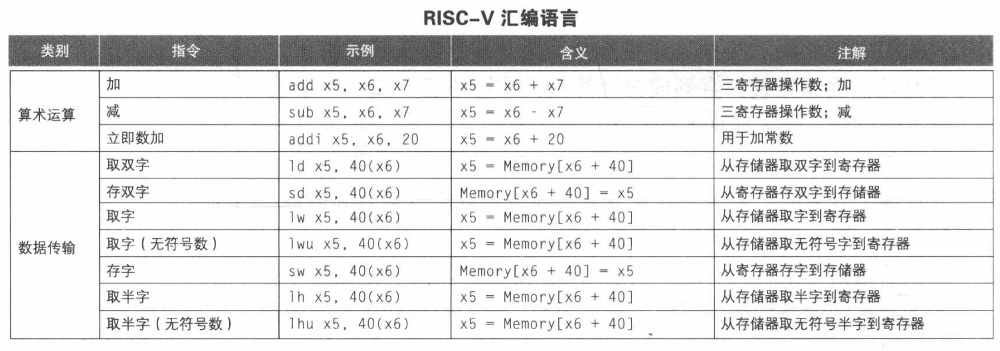
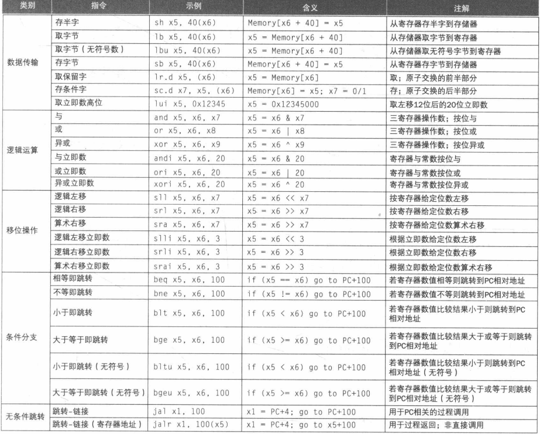
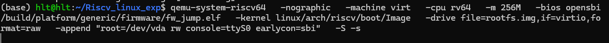
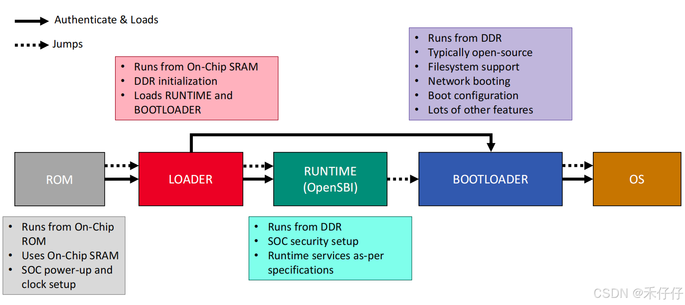
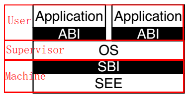

# Linux在RiscV架构上的迁移

## Riscv部分基础指令集：
### RiscV 基础整数编程模型
RiscV类似于Linux的原因之一便是其拓展指令集的模块化，在拓展指令集之上可以分为整数指令集（I）、乘除法扩展（M）、原子操作扩展（A）、单精度浮点扩展（F）、双精度浮点扩展（D）等。

在基础整数ISA上并没有专门的栈指针或子程序返回地址链接的寄存器；指令编码允许任何的x寄存器用于这些目的。但是，RiscV约定了某些寄存器用于特定的用途，以便于软件的编写和理解。

RiscV的32个寄存器的功能：
| 寄存器 | 别名  | 功能描述               |
|--------|-------|------------------------|
| x0     | zero  | 恒为0                  |
| x1     | ra    | 返回地址寄存器         |
| x2     | sp    | 堆栈指针寄存器         |
| x3     | gp    | 全局指针寄存器         |
| x4     | tp    | 线程指针寄存器         |
| x5-x7     | t0-t2    | 临时寄存器0-2    |
| x8     | s0/fp | 保存寄存器0/帧指针   |
| x9     | s1    | 保存寄存器1            |
| x10-x11    | a0-a1    | 函数参数/返回值寄存器   |
| x12-x17    | a2-a7    | 函数参数寄存器         |
| x18-x27    | s2-s11   | 保存寄存器2-11      |
| x28-x31    | t3-t6    | 临时寄存器3-6      |


### 基础指令格式
RiscV指令集采用固定的32位指令长度，指令格式主要分为以下几种类型：
1. R型指令（寄存器-寄存器操作）
2. I型指令（立即数操作）
3. S型指令（存储操作）
4. B型指令（分支操作）
5. U型指令（上位立即数操作）
6. J型指令（跳转操作）

### 基础的一些汇编指令




### 第一次读处理器架构见到的指令
#### 内存排序指令(fence)：
fence我们翻译为栅栏，用于控制内存操作的顺序，确保在fence指令之前的所有内存操作(load/store)在fence指令之后的所有内存操作之前完成。这一点和栅栏的功能类似。确保了多核（或多线程）环境下内存操作的可见性和一致性。

**为什么需要fence？**

这涉及RISC-V的存储模型。RISC-V采用的是 RISC-V Weak Memory Ordering (RVWMO)模型，对存储操作的执行顺序限制较少，为了保证一致性需要特殊的指令来规范存储操作的执行顺序。


fence指令的语法如下：
```asm
fence [pred], [succ]
```
pred, succ由四个字段组成：
- I: 输入（Input）
- O: 输出（Output）
- R: 读（Read）
- W: 写（Write）

实际上，在标准 RISC-V 中，I 和 O 通常被忽略或视为保留，主流实现主要关注 R 和 W。：
```asm
fence rw, rw  # 最严格的屏障：所有 load/store 之前的操作必须完成，之后的操作不能提前
fence r, w     # load 之后的 store 不能重排到 load 之前（常用于 acquire 语义）
fence w, r     # store 之后的 load 不能重排到 store 之前（常用于 release 语义）
```

#### 指令获取屏障(fense.i)：
fence是对内存的数据访问行为进行排序，而fence.i是对取指行为进行排序。确保 写入内存的指令对后续取指可见。

假设CPU中并无分离的icache和dcache，那么当我们某时刻使用store指令修改内存中的某个指令之后，下一次 CPU 取指时会直接从内存读取最新内容。
但为了防止流水线中已经预取了旧指令，只需 清空（flush）流水线，让后续取指从更新后的内存地址重新开始。

但是对于有独立指令缓存（icache）和数据缓存（dcache）的CPU来说，情况就不同了。因为store指令修改的是数据缓存，而取指是从指令缓存中获取指令的，这两个缓存是独立的，修改数据缓存并不会自动更新指令缓存。

因此，在这种情况下，必须使用fence.i指令来确保指令缓存中的内容与内存中的内容一致。fence.i指令会强制刷新指令缓存，使得后续的取指操作能够获取到最新的指令内容。
#### 环境调用和断点

SYSTEM指令用于访问可能需要访问特权的系统功能，使用I指令进行编码。这些指令可被分为两部分：原子性的“读-修改-写”控制和状态寄存器(CSR)相关的指令，所有其他潜在特权指令；基础的非特权指令：

```asm
ecall  # 环境调用指令，用于从用户模式切换到特权模式，通常用于系统调用
ebreak # 断点指令，用于调试目的
```
### 原子操作:
#### AMO原子内存操作:
原子内存操作为多处理器同步执行读-写-修改操作，确保对共享内存的操作不会被其他处理器或线程打断，从而避免数据竞争（data race）问题

为什么需要AMO?
```asm
// 假设 x = 0
Core1: load x → 0; add 1 → 1; store x → x=1
Core2: load x → 0; add 1 → 1; store x → x=1  // 期望结果是2，实际是1！
```
AMO 指令将“读-改-写”整个过程变成**不可分割**的原子操作

支持的操作有：交换、整数加法、按位 AND、按位 OR、按位 XOR、有符号/无符号整数的
取最大值/取最小值
```asm
amoadd.w rd, rs2, (rs1)  # 将内存地址(rs1)处的值加上rs2的值，结果存回内存，并将原值加载到rd
amoxor.w rd, rs2, (rs1)  # 将内存地址(rs1)处的值与rs2的值进行按位异或，结果存回内存，并将原值加载到rd
amoand.w rd, rs2, (rs1)  # 将内存地址(rs1)处的值与rs2的值进行按位与，结果存回内存，并将原值加载到rd
amoor.w rd, rs2, (rs1)   # 将内存地址(rs1)处的值与rs2的值进行按位或，结果存回内存，并将原值加载到rd
amoswap.w rd, rs2, (rs1)  # 将rs2的值存回内存地址(rs1)，并将原值加载到rd
amomin[u].w rd, rs2, (rs1)   # 将内存地址(rs1)处的值与rs2的值进行比较，取较小值存回内存，并将原值加载到rd
amomax[u].w rd, rs2, (rs1)   # 将内存地址(rs1)处的值与rs2的值进行比较，取较大值存回内存，并将原值加载到rd

```

#### LR/SC:
虽然 AMO 指令可以高效完成“读-改-写”类的固定原子操作（如加法、交换等），但无法实现条件性原子操作（如仅当内存值等于某个预期值时才进行更新）。为了解决这个问题，RISC-V 引入了 Load-Reserved (LR) 和 Store-Conditional (SC) 指令对。

##### LR:从内存地址加载一个值到寄存器,同时，对该地址设置一个“保留标记”（reservation），表示当前 hart（硬件线程）正在“监视”这块内存
```asm
lr.w rd, (rs1)  # 从内存地址(rs1)加载一个字到寄存器rd，并设置保留标记
```
##### SC:尝试将寄存器的值存回内存地址，但只有在该地址的保留标记仍然有效时才成功
```asm
sc.w rd, rs2, (rs1)  # 尝试将寄存器rs2的值存回内存地址(rs1)
                        if rd == 0 success!
                        elif rd == 1 fail!
```
1. LR 和 SC 必须作用于同一个对齐的内存地址
2. 在 LR 和 SC 之间不能有太多指令（某些实现有“保留窗口”限制）
3. 如果其他 hart 修改了该地址，或发生了中断、异常等，**保留标记**会被清除，导致 SC 失败。
4. 不可嵌套，一次只能有一个有效的LR/SC对，再次执行LR会覆盖之前的保留标记。

例如实现spinlock：
```asm
lock:
    li t0, 1
try_lock:
    lr.w t1, (a0)        #a0 是一个符号调用的地址，在此之前的代码可能类似于:
                load a0, lock_variable_address  (volatile int mylock=0, lock(&mylock))
                jal lock                        


    bnez t1, try_lock 
    sc.w t2, t0, (a0)
    bnez t2, try_lock
    ret
unlock:
    li t0, 0
    fence w, w 
    sw t0, (a0)
    ret
```

### 控制与状态寄存器指令(CSR)
RISC-V架构定义了一组控制与状态寄存器(CSR)，用于管理处理器的各种功能和状态。CSR指令允许软件读取和修改这些寄存器，以实现特权操作、异常处理、中断管理等功能。
CSR指令主要包括以下几种类型：
1. 原子性读/写CSR
2. 原子性读/置位CSR
3. 原子性读/清除CSR 

CSR指令的语法如下：
```asm
csrrw rd, csr, rs1  # 读取CSR寄存器的值到rd，并将rs1的值写入CSR寄存器
csrrs rd, csr, rs1  # 读取CSR寄存器的值到rd，rs1中的初始值被视为位掩码，从CSR寄存器中设置相应的位
csrrc rd, csr, rs1  # 读取CSR寄存器的值到rd，rs1中的初始值被视为位掩码，从CSR寄存器中清除相应的位

对于csrrw，如果rd=x0，则表示仅写CSR寄存器而不读取其值。
对于csrrs和csrrc，如果rs1=x0，则表示仅读取CSR寄存器的值而不修改其内容。

读csr的汇编伪指令：
csrr rd, csr  ==   csrrs rd, csr, x0
写csr的汇编伪指令：
csrw csr, rs1  ==   csrrw x0, csr, rs1
```
### RVWMO内存一致性模型
RVWMO即RISC-V Weak Memory Ordering，是RISC-V架构定义的一种内存一致性模型。它允许处理器在执行内存操作时进行一定程度的重排序，以提高性能和并行性。

用于规定多核（或多线程）环境下，不同 hart（硬件线程）对共享内存的读写操作在何时、以何种顺序对其他 hart 可见。

也就是说，运行在一个硬件线程的代码a看似是在有序地执行，但是从另一个硬件线程的内存指令来看，可能a内存指令正在以一种不同的次序被执行。RVWMO允许这种行为，以便处理器可以更高效地利用其资源。具体而言：
#### 不允许重排序
```
load -> load 同一个hart中， 两个load必须按照顺序执行
load -> store 同一个hart中， load必须在store之前完成
store -> store 同一个hart中， 两个store必须按照顺序执行
```
#### 允许重排序
```
store -> load 同一个hart中， store可以在load之前完成
```

我们观察允许重排序的部分，试想一下，如果两个hart之间相互影响，即第二个hart的load依赖于第一个hart的store，那么就会出现问题：
```asm
; Hart 0                  ; Hart 1
sw x1, flag0             lw x2, flag1
lw x3, flag1             sw x4, flag0

顺序执行的情况下，不可能出现 x3 == 0 && x2 == 0 的情况

但是在允许重排序的情况下，就可能出现这种情况：
Hart 0 可能先执行 lw x3, flag1（看到 0），再执行 sw x1, flag0;
Hart 1 可能先执行 lw x2, flag0（看到 0），再执行 sw x4, flag1;
``` 

因此多线程代码也需要显式同步，来保证不同hart之间的内存操作顺序。

因此需要之前提到的fence来限制重排序

#### 保留的程序次序



### C标准拓展（压缩）
RVC 使用了一个简单的压缩策略，它提供常见 32 位 RISC-V 指令的较短的 16 位版本，当：
1. 立即数或地址偏移量较小，或者
2. 其中一个寄存器是零寄存器（x0）、ABI 链接寄存器（x1），或者 ABI 栈指针（x2），或者
3. 目的寄存器和第一个源寄存器完全相同，或者
4. 使用的寄存器是 8 个最流行的寄存器。

C拓展允许16位的指令和32位的指令混合，其中32位指令可以从任何16位的边界开始。

## Linux Riscv的迁移

### Linux启动流程：



1. 系统上电或者复位重启后，从ROM启动，将SPL加载到片上SRAM
2. 引导spl运行：1、初始化ddr，2、加载opensbi（RUNTIME）和uboot（BOOTLOADER）到DDR
3. 引导opensbi运行：1、基础硬件初始化 2、系统安全配置等
4. 引导u-boot启动： 1、文件系统、网络、存储等配置 2、从存储（EMMC、DRAM等）中加载Linux（OS）到DDR
5. 最后运行在RISCV core上的只有opensbi和Linux，而Linux可以通过sbi接口来调用opensbi

首先理解一下这其中的术语和原因：
```txt
SPL:二级程序加载器，虽然叫 “二级”，但在很多系统中它实际上是 第一级可编程的 bootloader。

片上 SRAM（On-Chip SRAM）：集成在 SoC 芯片内部的小容量静态 RAM（通常 64KB ~ 512KB）

DDR：双倍数据速率同步动态随机存取存储器，传统的 SDRAM（Single Data Rate）在每个时钟周期的上升沿传输一次数据。DDR 内存在每个时钟周期的上升沿和下降沿都传输数据，数据传输速率是时钟频率的两倍。

注意：DDR 不像 SRAM 那样上电就能用，它需要复杂的初始化序列。
同时SRAM的太小，无法存放完整的bootloader和OS，所以需要先用SPL初始化DDR，然后再加载更大的程序到DDR中运行。
```

### opensbi简介
OpenSBI（Open Source Supervisor Binary Interface）是一个开源的RISC-V特权软件实现，提供了RISC-V处理器与操作系统之间的接口。它实现了RISC-V的Supervisor Binary Interface（SBI），允许操作系统在特权模式下运行，并提供了一些基本的系统服务，如中断处理、定时器管理和内存管理等。



#### 动机：
OpenSBI的设计主要是为了提供一个标准化的接口，不同的厂商可能有不同的M-mode代码， 如果每个操作系统都要适配不同厂商的M-mode代码，那么工作量会非常大。OpenSBI作为一个中间层，提供了一个统一的接口，操作系统只需要适配OpenSBI，而不需要关心底层的M-mode实现。

#### 三种用法：
|模式|描述|对应二进制文件|
|----|----|--------------|
|fw_jump|仅提供SBI服务，跳转到外部payload(Uboot或Linux)|fw_jump.elf|
|fw_payload|包含SBI服务和payload（Uboot或Linux）|fw_payload.elf|
|fw_dynamic|SBI服务和payload分开加载|fw_dynamic.elf|

因此需要重定位支持(rela_dyn_start)，PMP对齐。

#### OpenSBI的链接脚本和启动汇编：
从链接脚本里可以清晰地看到固件的地址规划和排布

**fw_jump.elf.ldS**:
```ld
OUTPUT_ARCH(riscv)
ENTRY(_start)

SECTIONS
{
	#include "fw_base.ldS"

	PROVIDE(_fw_reloc_end = .);
}
```

**fw_base.ldS**:

代码量较长，首先设置固件起始地址：
```ld
. = FW_TEXT_START;
	/* Don't add any section between FW_TEXT_START and _fw_start */
	PROVIDE(_fw_start = .);
```
接下来每一段都是以section的形式进行划分，对齐到4KB的页大小，便于内存管理。
分为以下几部分：
```ld
    .text : { *(.text*) }           // 代码段
    .rodata : { *(.rodata*) }       // 只读数据段
    .dynsym : { *(.dynsym*) }       // 动态符号表
    .rela.dyn : { *(.rela.dyn*) }   // 动态重定位表

***在此之前是只读部分***
    /*
	 * PMP regions must be to be power-of-2. RX/RW will have separate
	 * regions, so ensure that the split is power-of-2.
	 */
	. = ALIGN(1 << LOG2CEIL((SIZEOF(.rodata) + SIZEOF(.text)
				+ SIZEOF(.dynsym) + SIZEOF(.rela.dyn))));
***在此之后是rw部分***
而上述代码的部分就是假设只读部分大小不是2的幂次方，那么通过ALIGN对齐到下一个2的幂次方地址，方便PMP（Physical Memory Protection，物理内存保护）进行权限划分。

    .data : { *(.data*) }           // 数据段
    .bss : { *(.bss*) }             // 未初始
```
### OpenSBI初始化：
根据连接脚本fw_jump.elf.ldS，程序入口点为_start，从start开始：

1. _start:选择用来boot的hart